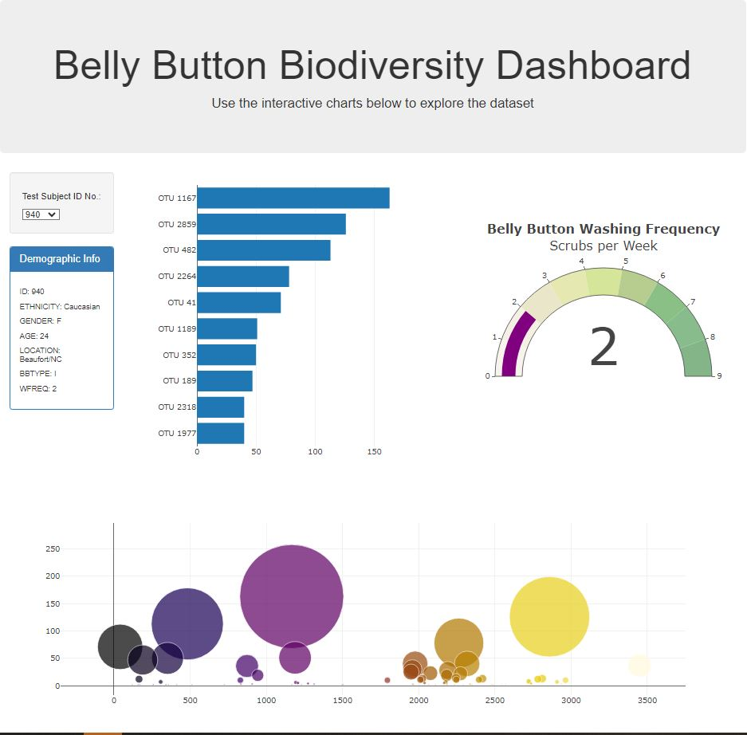

# Belly Button Biodiversity
 ## Overview
 This project builds an interactive dashboard to explore the [Belly Button Biodiversity Dataset](https://robdunnlab.com/projects/belly-button-biodiversity), which catalogs the microbes that colonize human navels.  
  
 The dataset reveals that a small handful of microbial species (also called operational taxonomic units, or OTUs, in the study) were present in more than 70% of people, while the rest were relatively rare.

 ## Dashboard
 ### App deployed using Github Pages
 [Interactive Dashboard Link](https://ajuarez2112.github.io/belly-button-challenge/)  

### Features
- Creates a dropdown menu that allows users to select through various samples
- Creates a horizontal bar chart with a dropdown menu to display the top 10 OTUs found in that individual
- Creates a bubble chart that displays each sample
- Adapts the [Gauge Chart](https://plot.ly/javascript/gauge-charts/) to plot the weekly washing frequency of the individual.
- Displays the sample metadata, i.e., an individual's demographic information
- Displays each key-value pair from the metadata JSON object somewhere on the page
- Updates all the plots when a new sample is selected

### Preview of the Dashboard

## Data
The data is loaded from an [external link](https://2u-data-curriculum-team.s3.amazonaws.com/dataviz-classroom/v1.1/14-Interactive-Web-Visualizations/02-Homework/samples.json) using the D3 library. This data can also be found in the `samples.json` file in the resources folder. This contains sample information and metadata for various Test Subjects.

## Technologies Used
[Bootstrap](https://getbootstrap.com/)  
[D3.JS](https://d3js.org/)  
[Plotly](https://plotly.com/javascript/)
